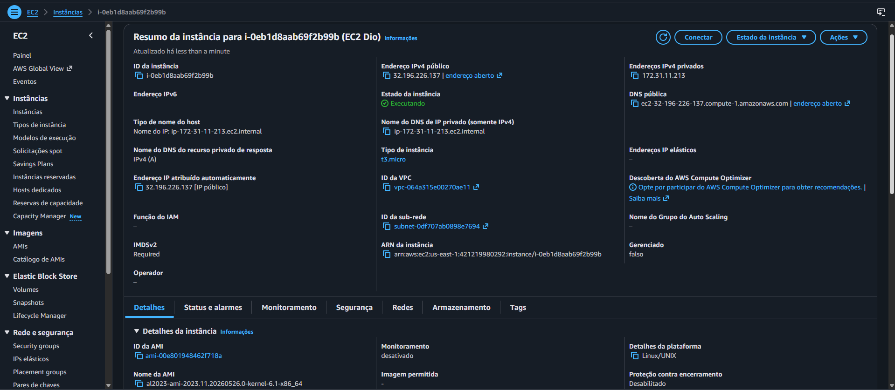

# desafio-ec2-dio

# Gerenciando Instâncias EC2 na AWS

## Objetivo

Este projeto foi desenvolvido durante o laboratório da DIO com o objetivo de praticar a criação e gerenciamento de instâncias EC2 na AWS.

## O que aprendi

- Conceitos de Cloud Computing
- Criação de instâncias EC2
- Escolha de AMI
- Configuração de Security Groups
- Conexão com a instância
- Monitoramento básico

## Etapas realizadas

### 1. Acesso ao Console AWS
Realizei login na plataforma AWS e naveguei até o serviço EC2.

### 2. Criação da Instância
- Escolhida uma AMI Linux
- Selecionado o tipo t2.micro
- Configurado armazenamento
- Configurado Security Group

### 3. Inicialização
Lançamento da instância e verificação do status.

## 4. Capturas de Tela

## Conclusão

O laboratório permitiu compreender na prática o processo de provisionamento e gerenciamento de servidores virtuais na AWS.

## Referências

- Documentação AWS EC2
- Material da DIO
